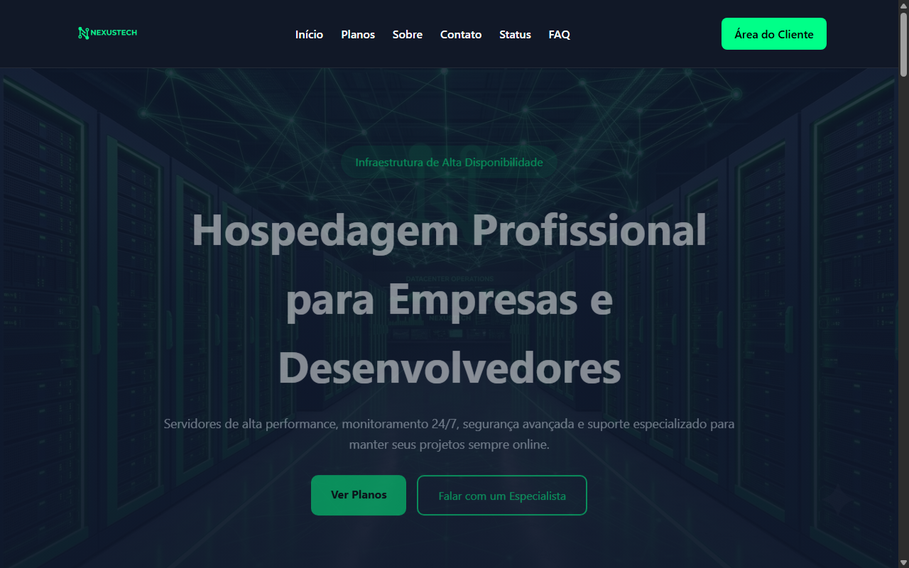
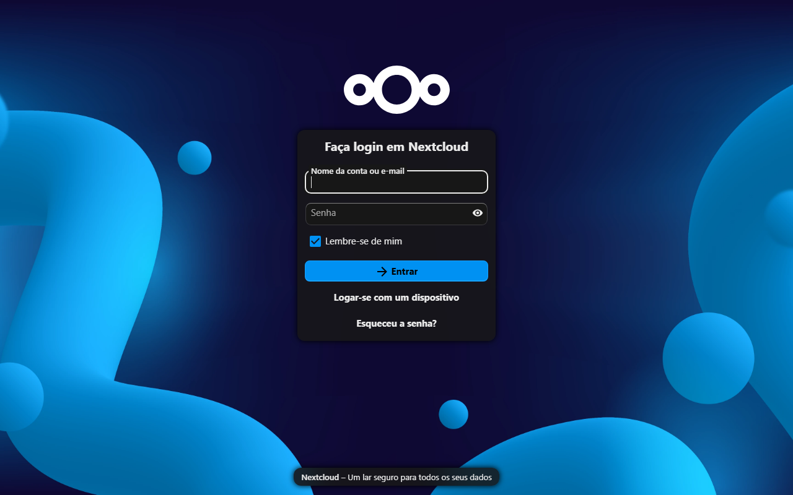
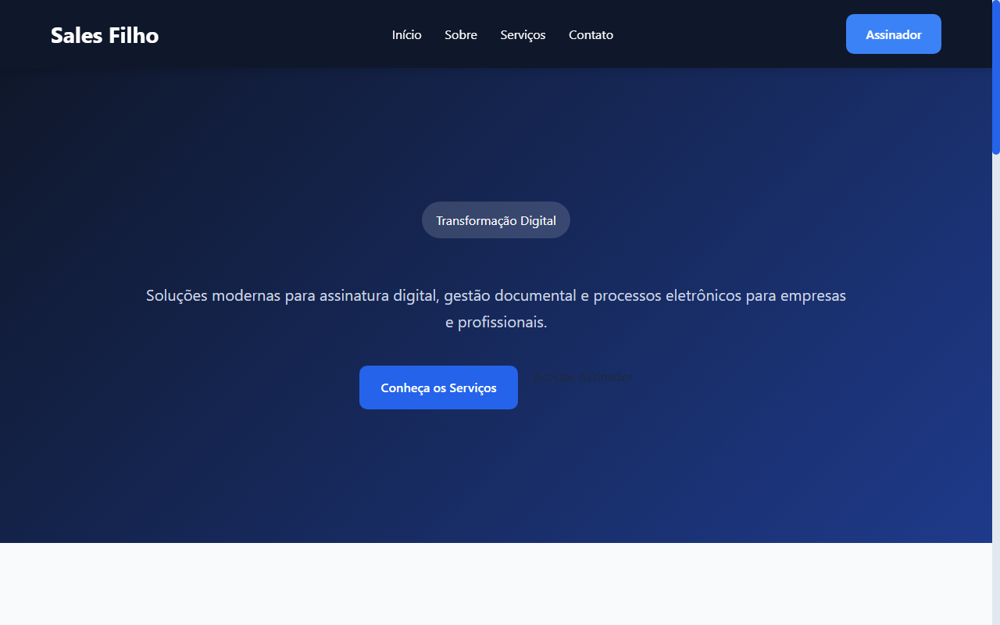
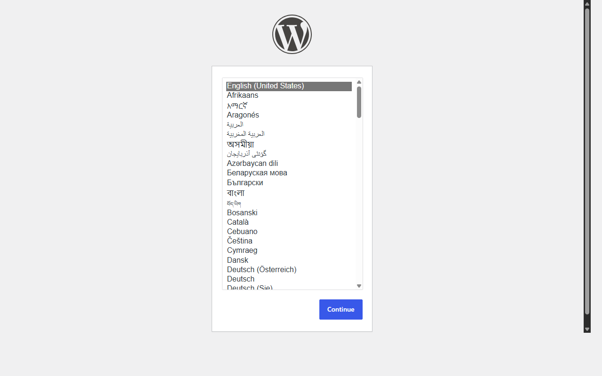
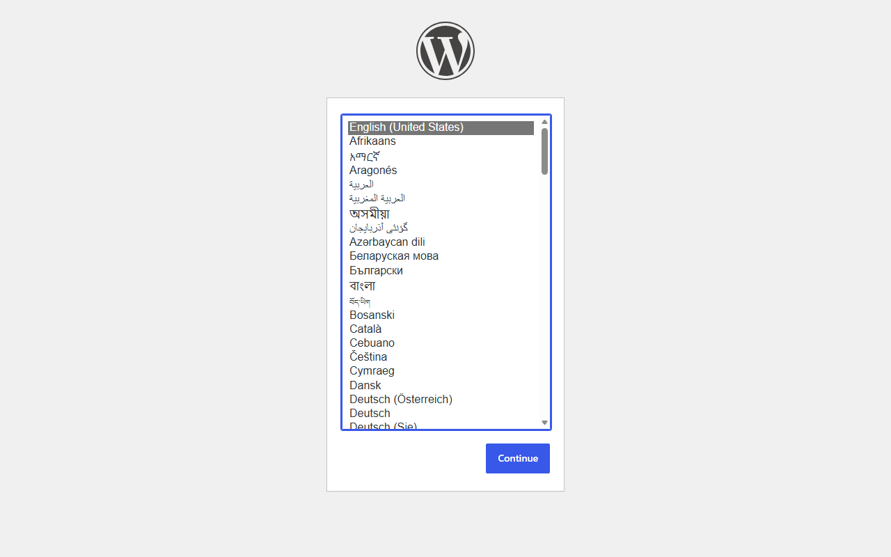

# 🧪 Relatório de Validação e Testes de Infraestrutura (NexusTech ISP)

Este relatório consolida os testes de conectividade, resolução de nomes, roteamento de proxy, segurança SSL/TLS e isolamento de rede efetuados nos containers Docker do provedor de internet e de seus clientes, acompanhado das respectivas capturas de tela.

---

## 1. Nota de Execução e Captura de Telas
> [!NOTE]
> Para contornar a dependência do Playwright, as capturas de tela foram automatizadas localmente utilizando o Microsoft Edge no modo headless, apontando diretamente para os domínios mapeados em tempo de execução no arquivo `hosts` do Windows.

---

## 2. Testes de Resolução de DNS (PowerDNS)

Configuramos o PowerDNS para responder como servidor autoritativo principal. Efetuamos consultas locais contra a porta 53 do container `DNSISP` para certificar que os subdomínios dos clientes e do provedor estão resolvendo para o IP correto do laboratório (`10.25.2.190`):

### Domínio NexusTech (ISP)
```powershell
PS C:\> nslookup nexustech.com.br 127.0.0.1
Servidor:  UnKnown
Address:  127.0.0.1

Nome:    nexustech.com.br
Address:  10.25.2.190
```
- **Status**: ✅ **Sucesso**. Domínio raiz apontando para o IP correto.

### Domínio do Cliente 1
```powershell
PS C:\> nslookup salesfilho.com.br 127.0.0.1
Servidor:  UnKnown
Address:  127.0.0.1

Nome:    salesfilho.com.br
Address:  10.25.2.190
```
- **Status**: ✅ **Sucesso**. Domínio do Cliente 1 apontando para o IP correto.

### Domínio do Cliente 2 (WordPress CMS)
```powershell
PS C:\> nslookup cms.cliente2.com.br 127.0.0.1
Servidor:  UnKnown
Address:  127.0.0.1

Nome:    cms.cliente2.com.br
Address:  10.25.2.190
```
- **Status**: ✅ **Sucesso**. O subdomínio `cms` do Cliente 2 resolve para o IP correto.

### Domínio do Cliente 3 (WordPress CMS)
```powershell
PS C:\> nslookup cms.cliente3.com.br 127.0.0.1
Servidor:  UnKnown
Address:  127.0.0.1

Nome:    cms.cliente3.com.br
Address:  10.25.2.190
```
- **Status**: ✅ **Sucesso**. O subdomínio `cms` do Cliente 3 resolve para o IP correto.

---

## 3. Testes de Roteamento HTTP (Proxy Reverso Nginx)

Verificamos o proxy reverso do ISP (`proxyISP` na porta 80) e as pontes com os proxies locais de cada cliente (`proxy-cliente1`, `proxy-cliente2`, `proxy-cliente3`). Os testes de requisição retornaram as seguintes respostas:

1. **Domínio Principal do ISP (`nexustech.com.br`)**:
   - Comando: `curl.exe -s -H "Host: nexustech.com.br" http://localhost`
   - Retorno: **`200 OK`**
   - **Status**: ✅ **Sucesso**.
2. **Webmail do ISP (`webmail.nexustech.com.br`)**:
   - Comando: `curl.exe -s -o NUL -w "%{http_code}" -H "Host: webmail.nexustech.com.br" http://localhost`
   - Retorno: **`302 Found`** (Redirecionamento do Nextcloud para a tela de login)
   - **Status**: ✅ **Sucesso**.
3. **Portal do Cliente 1 (`salesfilho.com.br`)**:
   - Retorno: **`200 OK`**
   - **Status**: ✅ **Sucesso**.
4. **WordPress CMS do Cliente 2 (`cms.cliente2.com.br`)**:
   - Retorno: **`302 Found`** (Redirecionamento para a tela de instalação)
   - **Status**: ✅ **Sucesso**.
5. **WordPress CMS do Cliente 3 (`cms.cliente3.com.br`)**:
   - Retorno: **`302 Found`** (Redirecionamento para a tela de instalação)
   - **Status**: ✅ **Sucesso**.

---

## 4. Teste de Criptografia SSL/TLS no E-mail (STARTTLS/SSL)

O Dovecot e o Postfix iniciaram sem falhas no container `email-ISP`. Executamos o handshake SSL no IMAPS (porta 993) e no SMTP Submission (porta 587) no container:

```bash
docker exec email-ISP openssl s_client -connect localhost:993 -brief
```
**Resultado do handshake IMAPS:**
```text
CONNECTION ESTABLISHED
Protocol version: TLSv1.3
Ciphersuite: TLS_AES_256_GCM_SHA384
Peer certificate: CN=mail.nexustech.com.br
Verification error: self-signed certificate
DONE
```
- **Status**: ✅ **Sucesso**. Dovecot efetuando negociação de criptografia TLSv1.3 segura.

```bash
docker exec email-ISP openssl s_client -connect localhost:587 -starttls smtp -brief
```
**Resultado do handshake SMTP Submission:**
```text
CONNECTION ESTABLISHED
Protocol version: TLSv1.3
Ciphersuite: TLS_AES_256_GCM_SHA384
Peer certificate: CN=mail.nexustech.com.br
Verification error: self-signed certificate
250 CHUNKING
DONE
```
- **Status**: ✅ **Sucesso**. Postfix efetuando negociação de STARTTLS com TLSv1.3 segura.

---

## 5. Testes de Isolamento de Redes dos Clientes

Comprovamos que as redes internas dos clientes estão isoladas. A partir de um container do Cliente 1 (`portal-cliente1`), tentamos realizar conexões/resoluções direcionadas ao Cliente 2 (`portal-cliente2`):

```bash
docker exec portal-cliente1 curl -I --connect-timeout 5 http://portal-cliente2
```
**Resultado:**
```text
curl: (6) Could not resolve host: portal-cliente2
```
- **Status**: ✅ **Sucesso**. O isolamento de DNS interno do Docker impede a resolução de nomes entre redes bridge distintas.

---

## 6. Capturas de Tela das Funcionalidades

### 🌐 Portal do Provedor (NexusTech)
O portal principal serve como página institucional do provedor NexusTech.


### 📧 Webmail do Provedor (Nextcloud Setup)
Interface do Webmail do provedor rodando sob Nextcloud.


### 🌐 Portal do Cliente 1 (Sales Filho)
Portal institucional estático do Cliente 1.


### 📄 Hotsite do Cliente 1 (Campanha)
Página adicional de campanha/hotsite para o Cliente 1.


### ✍️ App de Assinatura do Cliente 1 (Sign)
Acesso à API/App de assinaturas eletrônicas do Cliente 1.


### 📝 WordPress do Cliente 2 (Configuração Inicial)
Página de instalação do CMS WordPress configurado na rede privada do Cliente 2.


### 📝 WordPress do Cliente 3 (Configuração Inicial)
Página de instalação do CMS WordPress configurado na rede privada do Cliente 3.

